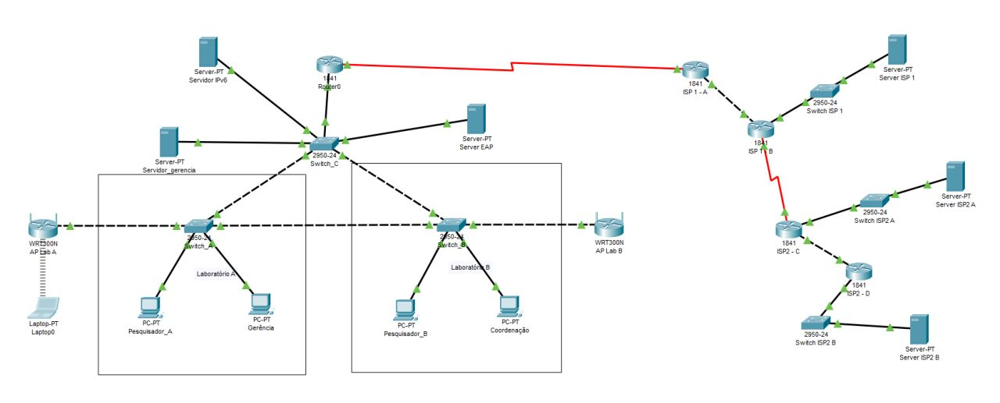

# Corporate Network Infrastructure

Projeto desenvolvido utilizando Cisco Packet Tracer para simular uma infraestrutura corporativa completa.

## Tecnologias

- VLAN
- DHCP
- ACL
- OSPF
- RIPv2
- IPv4
- IPv6
- SLAAC
- RADIUS

## Objetivo

Criar uma infraestrutura escalável para diferentes departamentos, utilizando segmentação lógica, autenticação centralizada e roteamento dinâmico.

## Funcionalidades

- DHCP para aproximadamente 500 dispositivos
- Segmentação por VLAN
- ACL para controle de acesso
- Comunicação entre roteadores utilizando OSPF e RIPv2
- Autenticação via RADIUS
- Ambiente Dual Stack (IPv4 e IPv6)

## Topologia

(colocaremos a imagem aqui)

## Arquivos

- Projeto Packet Tracer
- Documentação
- Capturas de tela

